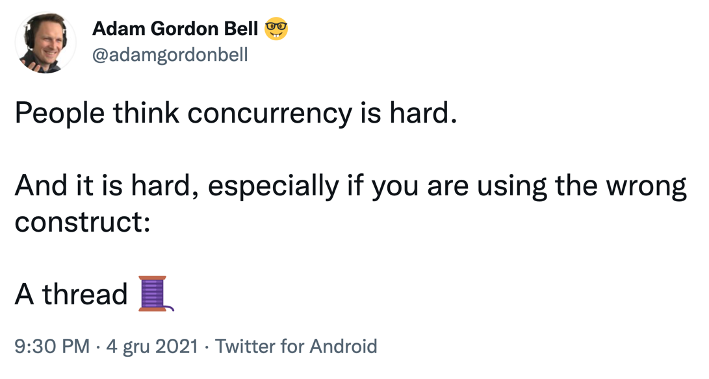

# CPU

Runs code.
Can have multiple cores.

# Threads

A running thread needs CPU core.
When a thread is blocked or waiting for I/O, it releases a CPU.

[twitter.com/adamgordonbell/status/1467229754029969408](https://twitter.com/adamgordonbell/status/1467229754029969408)